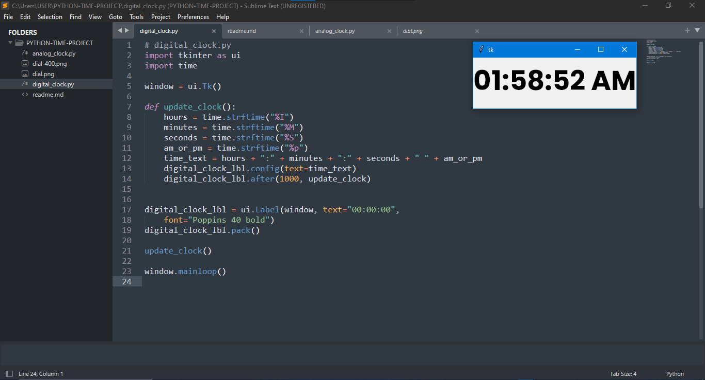
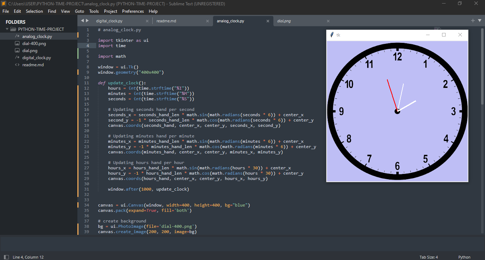

<!-- readme.md -->
# Digital And Analog Clock

I wrote a code on how an analog and digital clock that tell the exact time even down to seconds(also including Am & Pm for digital) using **tkinter** as User Interface(UI)

## Here's the formular for the Analog hands

```

import math
x = r * (sin(radians(t)))
y = -r * (cos(radians(t)))

```

### DIGITAL-CLOCK



### ANALOG-CLOCK


